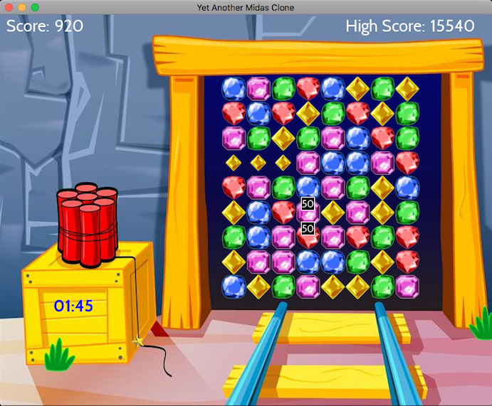

# yammc

        Yet Another Midas Miner Clone in C++

        My hobby project is to create a Midas Miner Clone the artwork/fonts/sfx
        is not mine and I consider it to be public domain. If someone disagree
        please let me know and I will remove it.

        I have spent the last 30 years developing software but the last game
        I wrote was a Tetris clone for the Hercules graphic card back in 1989.

        My goal is to make the game as similar as possible to the original:
        http://www.royalgames.com/games/puzzle-games/midas-miner

        Next update might include anything of the following:

        - Windows port
        - Use Catch instead of gtest
        - Refactor game statistics into its own class

        The project requires cmake 2.6 or higher, SDL2, SDL2_ttf, SDL2_mixer and a C++14 compliant
        compiler.
        The test suit requires gtest - installation guide below. If you do not care about the test
        suit just delete enable_testing and everything below in ./midas/CMakeLists.txt

        Only tested under OSX. All my development machines are OSX and Linux these days.

        make

        will build the project, default is a release build. Ninja is used if available

        Executables found here:

        ./build/midas/midas
        ./build/midas/midas_test

        or just type

        ./run

        Space restarts the game. M toggles the music on / off.

        If someone want to do a Windows port I would appriticate a pull request. The same goes
        for any other modification. I am an utter novice in the land of game development.

        How to install gtest:

        cd gtest-1.7.0
        mkdir build
        cd build
        cmake ..
        make

        sudo cp libgtest.a /usr/local/lib
        sudo cp libgtest_main.a /usr/local/lib

        Credits:
        All sfx and music are from www.freesound.org
        Fonts http://www.dafont.com/cabin.font
        Music by https://mrthenoronha.bandcamp.com
        FindSDL2_mixer https://github.com/rlsosborne/doom
        DeltaTimer adapted from http://headerphile.com/sdl2/sdl2-part-9-no-more-delays/
