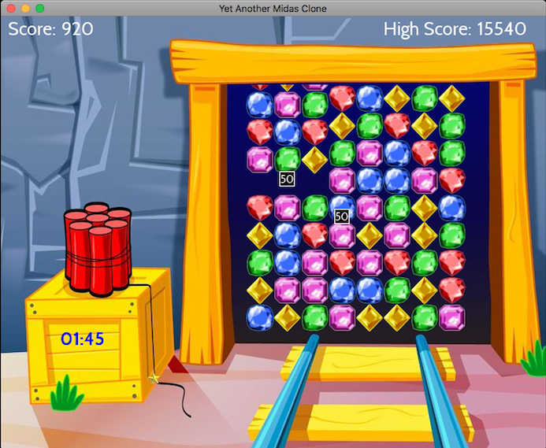

# YAMMC - Yet Another Midas Miner Clone



My hobby project is to create a clone of the game Midas Miner. The
artwork/fonts/sfx is not mine and I consider it to be public domain.
If someone disagree please let me know and I will remove it.

My goal is to make the game better then the original:
http://www.royalgames.com/games/puzzle-games/midas-miner

YAMMC has been tested and works under Windows 10 (x64 only),
OSX 10.12/10.13, Raspian GNU/Linux 9 (stretch) and Ubuntu 16.04

**Features:**
* Smooth Animation
* Many effects
* Music and sound
* Advanced scoring system

**Keyboard Commands**

Key | Action
--- | ------
Space  | Restart
M | Toggle music on/off
Trackpad / Mouse| Move cursor
Button 1|Select

## Build YAMMC

**Dependencies:**
* C++17 compliant compiler (e.g. clang 4/5, clang-9.0.0, Visual Studio 2017.3 or gcc 7.x.x)
* C++14 compliant STL implementation
* cmake 3.5.0 or later
* git
* SDL2 (x64 only)
* SDL2_ttf (x64 only)
* SDL2_mixer (x64 only)

The test suit requires catch - Catch will be automatically downloaded and installed
as part of the build process

**OSX / Linux**

Install the required libraries with apt/brew or any other package manager.

Builds the project, default is a release build. Ninja is used if available:

```bash
make
```

Starts the game:
```bash
make run
```

Runs the test suit:

```bash
make test
```

Run cppcheck (if installed) on the codebase with all checks turned-on:

```bash
make cppcheck
```

**Raspian GNU/Linux**

You need to activate the OpenGL driver otherwise the game will be far to slow.

The code builds cleanly and has been tested with GCC 7.3.0, instructions how
to install the compiler can be found here:

https://solarianprogrammer.com/2017/12/08/raspberry-pi-raspbian-install-gcc-compile-cpp-17-programs/

You need to set these flag before running make:

```bash
export PATH=/usr/local/gcc-7.3.0/bin:$PATH
export CXX=gcc-7.3.0

**64-bit Windows 10**

Set the following environment variables (see System Properties/Environment Variables...):

SDL2DIR
SDL2MIXER
SDL2TTFDIR

*Example:*
SDL2DIR C:\SDL2-2.0.5

The PATH should include all three libraries lib\x64 directories

*Example:*
PATH C:\SDL2-2.0.5\lib\x64;C:\SDL2_mixer\lib\x64;C:\SDL2_ttf-2.0.14\lib\x64

Generate Visual Studio project files with CMakeSetup.exe

## Credits

        All sfx and music are from www.freesound.org
        Fonts http://www.dafont.com/cabin.font
        Music by https://mrthenoronha.bandcamp.com
        FindSDL2_mixer https://github.com/rlsosborne/doom
        DeltaTimer adapted from http://headerphile.com/sdl2/sdl2-part-9-no-more-delays/
        https://github.com/philsquared/Catch
